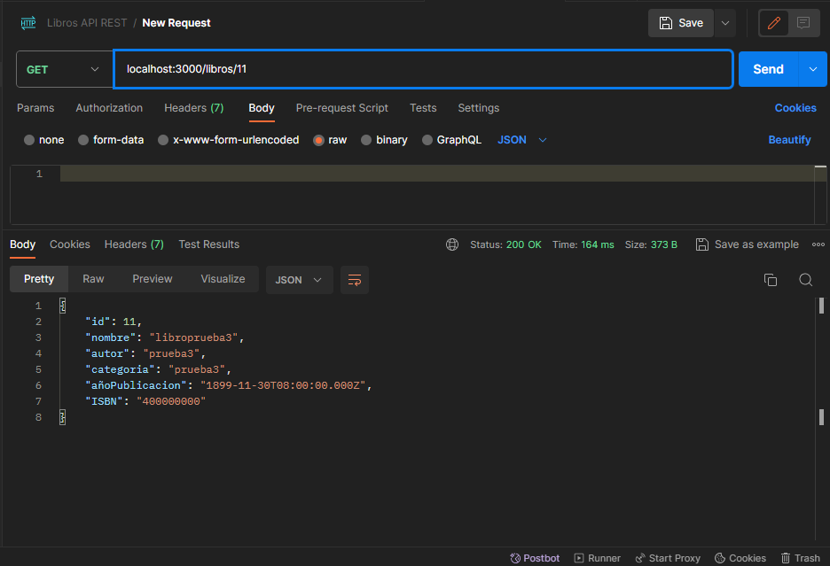
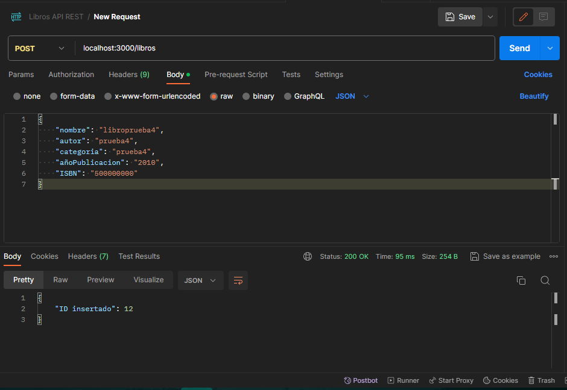
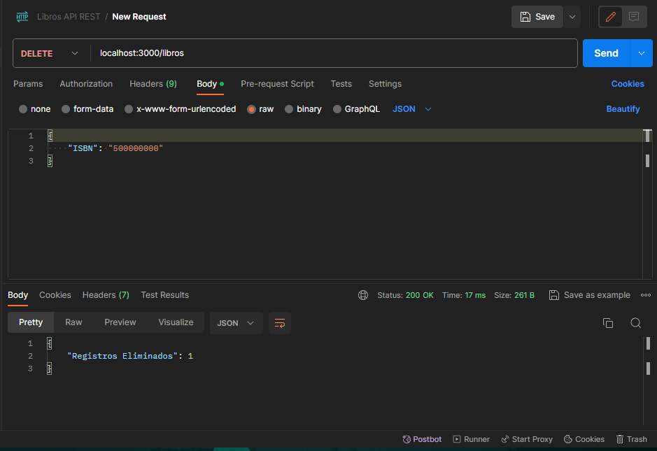
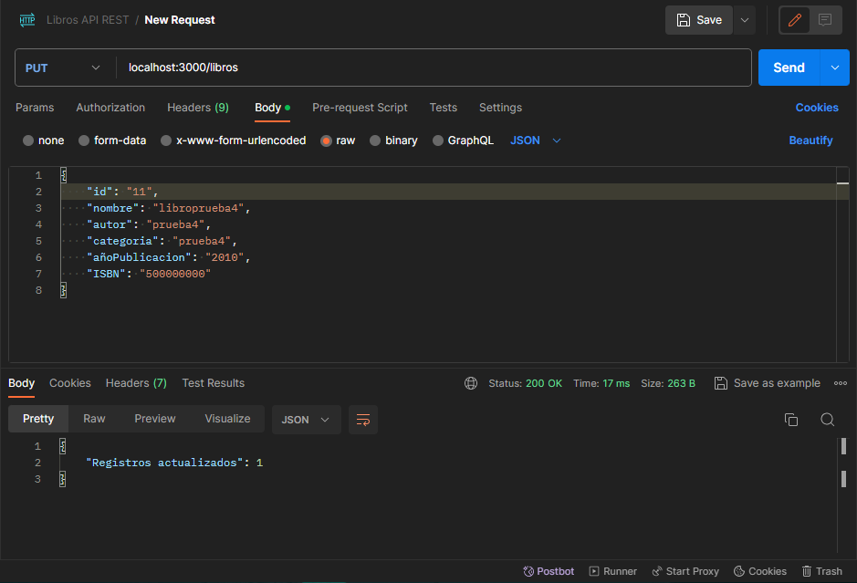

# rest-api-libros

## ✨ Para ver todos los libros:

**Solicitud GET: localhost:3000/libros**

_Solicitud para ver todos los libros en el database_

## ✨ Para ver un libro por id personalizado:

**Solicitud GET: localhost:3000/libros/id**

_Solicitud para ver un libro por ID personalizado_

## ✨ Para agregar un libro:

**Solicitud POST: localhost:3000/libros**

_Añadir un libro con sus parametros_

## ✨ Para eliminar un libro por ISBN:

**Solicitud DELETE: localhost:3000/libros**

_Eliminar un libro por isbn personalizado_

## ✨ Para actualizar un libro:

**Solicitud PUT: localhost:3000/libros**

_Ingresar id y actualizar parametros de un libro_

